# 🧠 PatientApp — Clinical Session & Patient Management System

---

**PatientApp** is a complete management system designed for psychologists, therapists, and independent health professionals.  
It centralizes patients, sessions, debts, notifications, and financial analytics into a modern and efficient workflow.

Built as a **full-stack project using React and Spring Boot**, it implements authentication, dashboards, automation, notifications, and full CRUD operations.

---

## 🌍 Problem Statement

Independent professionals often rely on fragmented tools (spreadsheets, messaging apps, paper notes) to manage:

- Sessions  
- Payments  
- Patient histories  
- Notifications  
- Scheduling  

This usually causes **errors, forgotten payments, double bookings, and lost information**.

**PatientApp** solves this by offering a unified and automated clinical management platform.

---

## 🎯 Main Objectives

- Centralize patient and session management  
- Automate reminders and notifications  
- Track past & upcoming sessions  
- Monitor debts and financial metrics  
- Provide a clean dashboard for fast decision-making  
- Enable real-time UI synchronization  

---

# 🧱 System Architecture

## Frontend (React)

- React + Hooks  
- Context API for global state  
- Custom hooks (sessions, notifications, authentication)  
- Protected routes using JWT  
- `apiFetch` wrapper with interceptor  
- Fully responsive design  

## Backend (Spring Boot)

- Spring Security + JWT  
- REST API (Controller → Service → Repository)  
- JPA + Hibernate  
- DTOs & Mappers  
- Automatic Notifications System  
- MySQL relational database  

---

# 🖥️ Features Overview

---

## ✅ Patient Management

Create, edit, archive, delete, and search patients easily.

### 📸 Patients Dashboard  
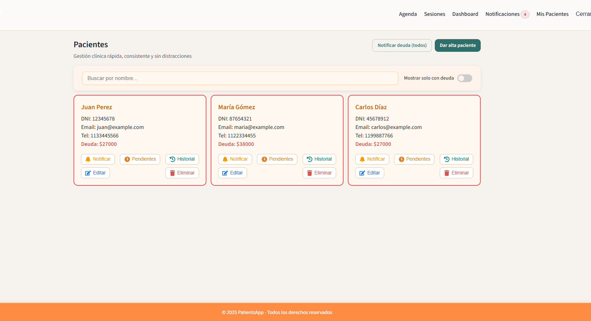

---

## ✅ Session Calendar & Scheduling

View upcoming sessions, past appointments, and handle payment status.

### 📸 Session Calendar  
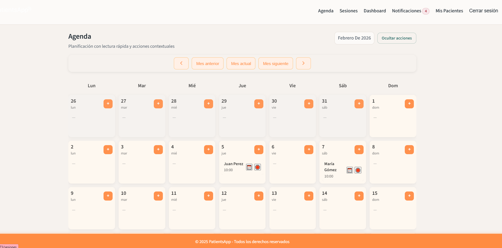

### 📸 Button Actions  

**Create Session:**  
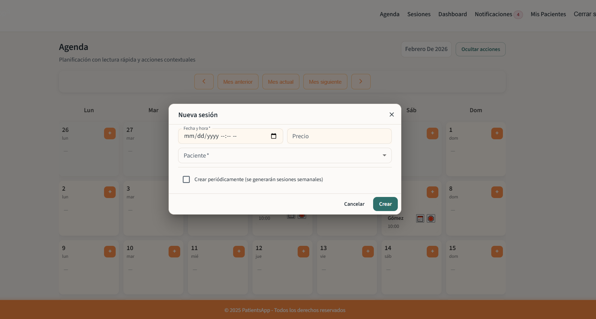

**Reschedule Session:**  
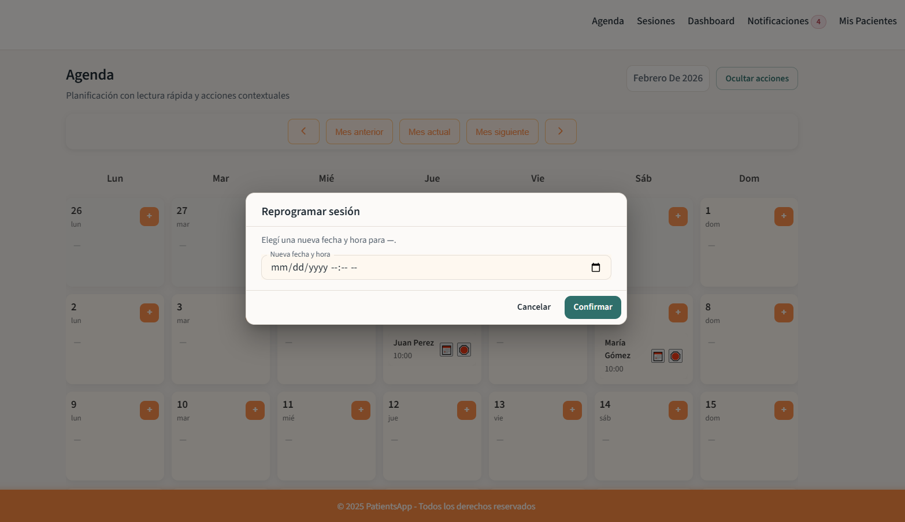

**Cancel Session:**  
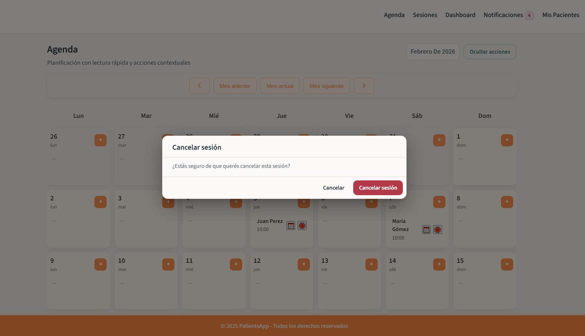

---

# 🗂️ Sessions Module

A complete module to manage all sessions in one place.

## 🔎 Filters  
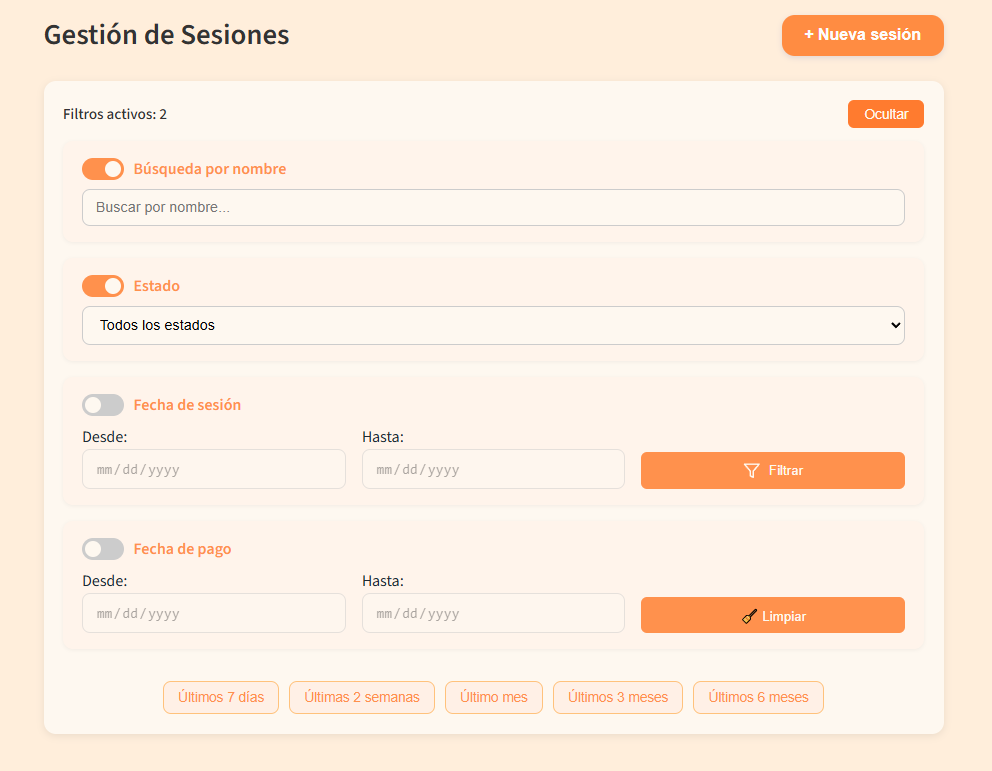

---

## 📋 Sessions List  
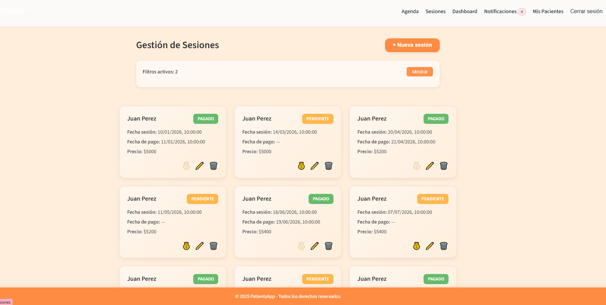

---

## ⚙️ Session Actions  
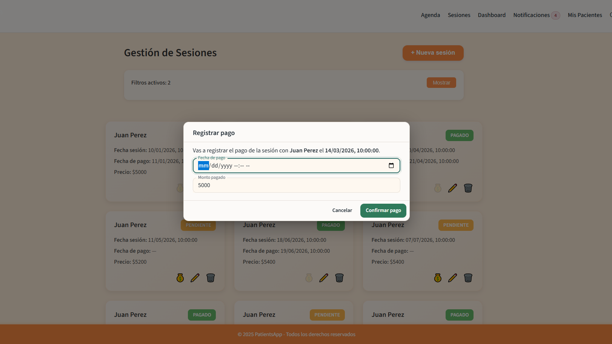

---

## 💰 Financial Dashboard

Monitor income, pending payments, monthly analytics, and performance insights.

### 📸 Financial Dashboard  
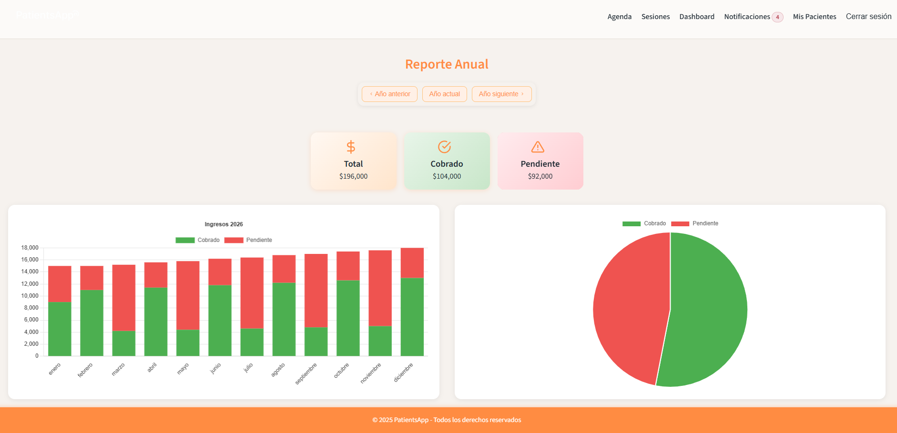  
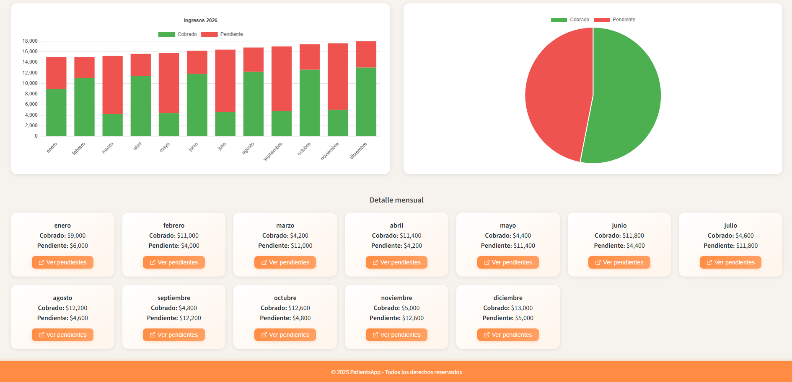

---

## 🔔 Smart Notifications (Auto-Generated)

The backend automatically generates notifications for:

- Today’s sessions  
- Pending payments  
- New patients  
- Reminder events  

Users can **mark as read**, **delete individually**, or **clear all**.

### 📸 Notifications Panel  
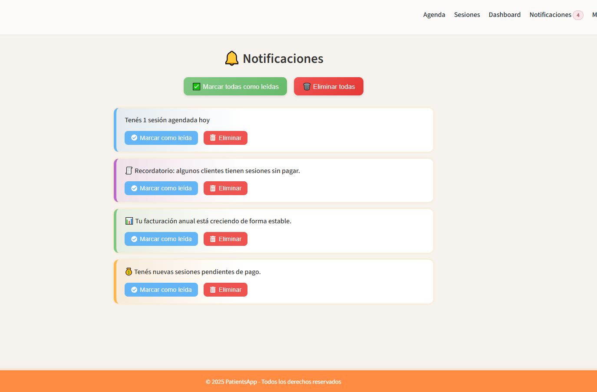

---

## 💳 Patient Debt & Reminders

Included inside the **Patient Dashboard** — send:

- Single reminders  
- Bulk reminders  

With one click.

---

# 📱 Responsive Design

The entire application is optimized for use on:

- Desktop  
- Tablet  
- Mobile  

### 📸 Mobile UI  
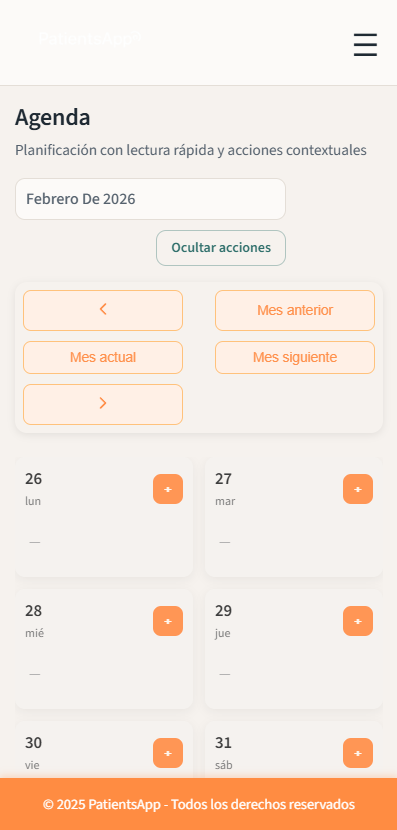  
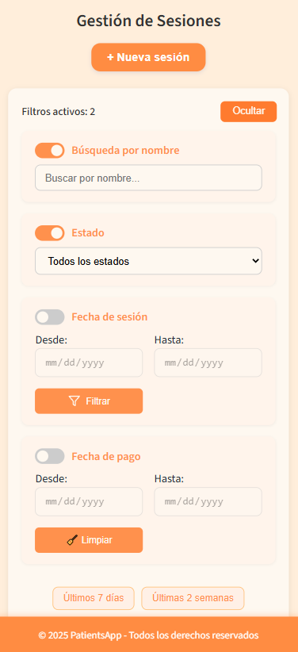  
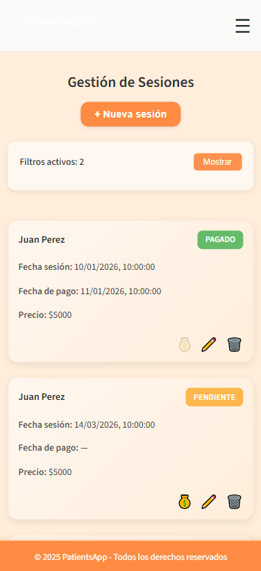  
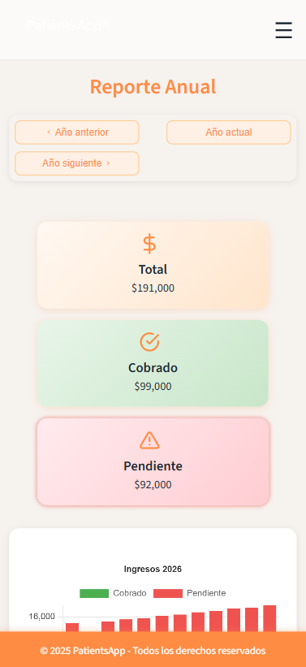  

---

# ⭐ Tech Stack

## Frontend
- React  
- Context API  
- Custom Hooks  
- JavaScript / TypeScript  
- React Router  
- CSS Modules  
- `apiFetch` wrapper  

## Backend
- Spring Boot  
- Spring Security (JWT)  
- JPA + Hibernate  
- MySQL  
- DTOs & Mappers  
- Custom JWT Filters  
- Notification Service  

---

# 🚀 Project Value

This project demonstrates:

- Full-stack development expertise  
- Authentication & Authorization workflow (JWT)  
- Clean layered architecture  
- Real-time notification logic  
- State management with Context + Hooks  
- A production-ready **CRUD + Dashboard** system  

---

